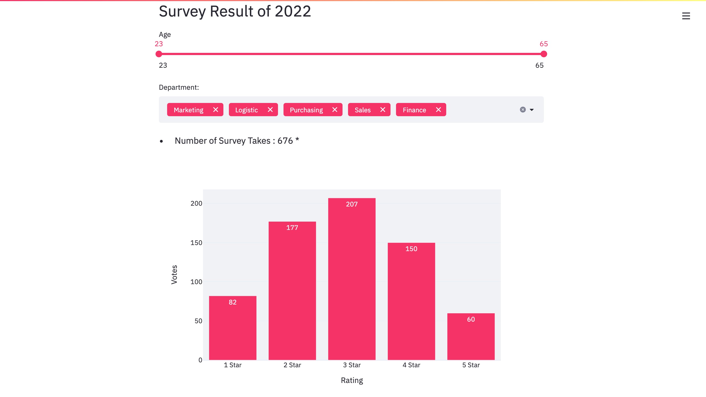

# Survey Analysis
An application that allows users to view the analysis of data on excel 

## Currently Supported DataSet  : 
*  Five Departments Survey Result [Marketing, Logistic, Purchasing,Sales, Finance]
*  Total Number of Persons : 676    
*  Age Group : [23 - 65]

### The UI 

## Used Python Packages  : 
*  streamlit 
*  plotly       
*  pandas  
* pandas
* openpyxl
* pillow

